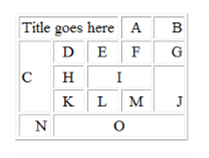

# HTML Tables

## Exercise 1
Create Web Pages like the following using tables:

## Exercise 2
Create a Web Page like the following using forms:

## Exercise 3
Create a Calculator-like table. You should use:
* HTML 5 `form` for the Calculator
* `Button` for all the numbers and operators (+, -, etc.)
* `Textbox` for the result
* Do not make the same styles as the example

