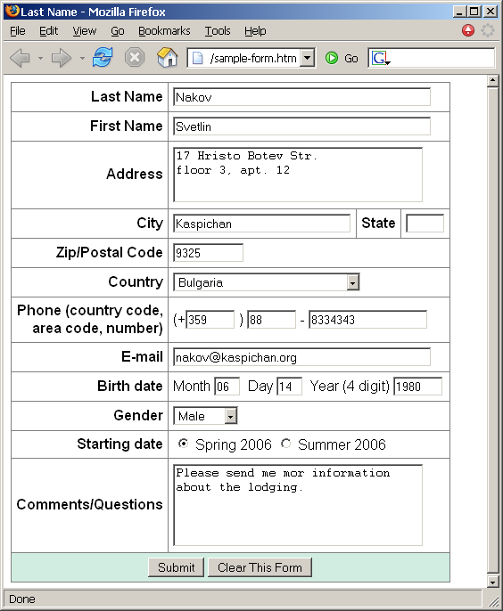
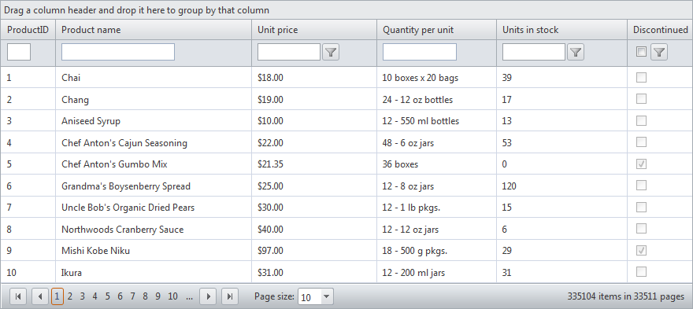

# HTML Forms Frames

## Exercise 1
Create a Web form that looks like this sample:

## Exercise 2
Create the following using tables and forms:

## Exercise 3
Construct the following Grid component:

* Try to make a HTML page, that looks just like the example
* Not required to style for the homework

## Exercise 4
Create the following HTML Page
* Hint: Use Fieldsets and Nested tables

